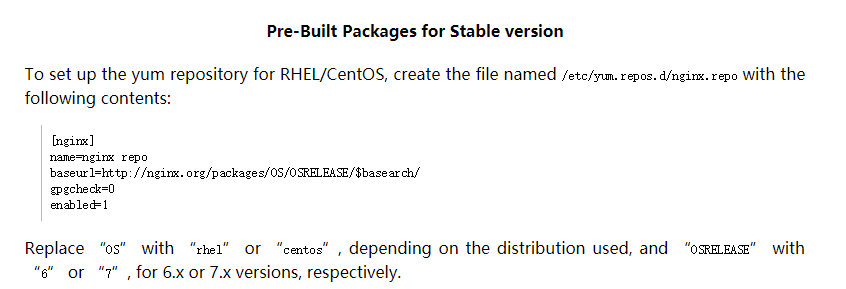
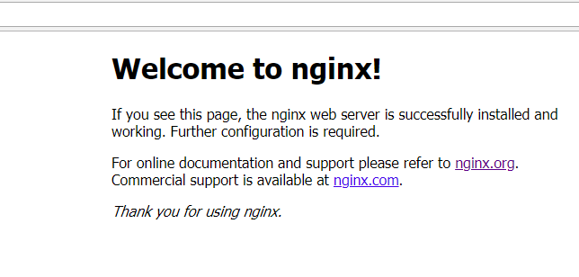

Ubuntu 14/16 下的 Laravel LNMP 线上环境自动部署脚本
>https://laravel-china.org/topics/2814/ubuntu-1416-under-the-laravel-lnmp-online-environment-automatically-deploy-scripts


### 首先安装vim：

```yum -y install vim-enhanced```

### 安装nginx：
到官网的download里面我们看到了 



`vim /etc/yum.repos.d/nginx.repo`
添加：
```
[nginx]
name=nginx repo
baseurl=http://nginx.org/packages/centos/7/$basearch/
gpgcheck=0
enabled=1
``` 
wq退出 `yum install nginx`
有提醒就按y

### 开启nginx与开机自启：

`systemctl start nginx`

`systemctl enable nginx`

### 重点开放防火墙80端口:

```php
firewall-cmd --zone=public --add-port=80/tcp --permanent
firewall-cmd --zone=public --add-port=80/udp --permanent
```
### 重启防火墙:

`systemctl restart firewalld.service`

然后在浏览器输入服务器的地址或者ip，显示界面，nginx安装成功



### 安装mysql

下载mysql源安装包：

`wget http://dev.mysql.com/get/mysql57-community-release-el7-8.noarch.rpm`

安装mysql源:

`yum localinstall mysql57-community-release-el7-8.noarch.rpm`

检查mysql源是否安装成功:

`yum repolist enabled | grep "mysql.*-community.*"`


安装mysql：

`yum install mysql-community-server`

启动mysql:

`systemctl start mysqld`

然后查看mysql的初始密码:

`grep 'temporary password' /var/log/mysqld.log`


修改mysql密码:

```php
shell> mysql -uroot -p
mysql> ALTER USER 'root'@'localhost' IDENTIFIED BY 'YourPassword9#'; 
```

修改mysql的默认编码为utf8

`vim /etc/my.cnf`
```php
[mysqld]
character_set_server=utf8
init_connect='SET NAMES utf8'
```


### 安装mysql：

首先删除之前安装的php：

`yum -y remove php*`

更改yum源：

```
rpm -Uvh https://dl.fedoraproject.org/pub/epel/epel-release-latest-7.noarch.rpm   
rpm -Uvh https://mirror.webtatic.com/yum/el7/webtatic-release.rpm 
```

安装各种扩展:

`yum -y install php72w php72w-cli php72w-common php72w-devel php72w-embedded php72w-fpm php72w-gd php72w-mbstring php72w-mysqlnd php72w-opcache php72w-pdo php72w-xml`

添加用户和用户组，之后用到:

```
groupadd www
useradd -g www www
```

修改php配置:

`vim /etc/php.ini`

修改 

`;cgi.fix_pathinfo=1` -> `cgi.fix_pathinfo=0`

修改php-fpm配置:

`vim /etc/nginx/nginx.conf`

```
user  www www;
worker_processes auto;
[...]
include vhost/*.conf;

    server{
        listen       80 default;
        server_name _ "";
        index error.html;
        root  /home/www/error;

        location /nginx_status {
            stub_status  on;
            access_log   off;
            allow 127.0.0.1;
            deny all;
        }
        location / {
            allow 127.0.0.1;
            deny all;
        }
    }
```
修改完成，然后我们这之中包含了一个`include vhost/*.conf`
然后创建vhost文件夹

```
cd nginx
mkdir vhost
cd vhost
vim index.conf

server {

    listen 80;
    listen [::]:80;

    server_name ;### 你的域名或者ip
    root /home/www/;
    index index.php index.html index.htm;

    location / {
         try_files $uri $uri/ /index.php$is_args$args;
    }

    location ~ \.php$ {
        try_files $uri /index.php =404;
        fastcgi_pass 127.0.0.1:9000;
        fastcgi_index index.php;
        fastcgi_buffers 16 16k;
        fastcgi_buffer_size 32k;
        include fastcgi_params;
    }

    location ~ /\.ht {
        deny all;
    }
}
```
添加完成，接着

`cd /home`

分别修改文件夹的用户组和用户和文件权限

```
chown -R www www
chgrp -R www www
chmod -R 755 www
```
进入www目录创建一个index.php文件 在其中写

```
<?php
    phpinfo()

```


### 安装git
`yum install git-core`

### 安装composer

```
curl -sS https://getcomposer.org/installer | php #安装composer包
mv composer.phar /usr/local/bin/composer #将composer放到全局环境当中
```
现在访问composer -v

composer太慢想修改composer源可以执行下面这段代码

`composer config -g repositories.packagist composer https://packagist.phpcomposer.com`


### 安装laravel

`composer global require "laravel/installer"`

然后到 /home/www执行

`composer create-project --prefer-dist laravel/laravel blog`

修改用户，用户组，权限
```
chown -R www www
chgrp -R www www
chmod -R 755 www
```

修改.env文件
```php
APP_NAME=Laravel
APP_ENV=local
APP_KEY=base64:zCWGDEsNSF0bmt/Gh/bdlcRHjWKCCiny6brrer5OZxA=
APP_DEBUG=true#线上改成false
APP_LOG_LEVEL=debug
APP_URL=你的服务器域名或者ip

LOG_CHANNEL=stack

DB_CONNECTION=mysql
DB_HOST=127.0.0.1
DB_PORT=3306
DB_DATABASE=你的数据库
DB_USERNAME=root
DB_PASSWORD=你的数据库密码

BROADCAST_DRIVER=log
CACHE_DRIVER=file
SESSION_DRIVER=file
SESSION_LIFETIME=120
QUEUE_DRIVER=sync

REDIS_HOST=127.0.0.1
REDIS_PASSWORD=null
REDIS_PORT=6379

MAIL_DRIVER=smtp
MAIL_HOST=smtp.mailtrap.io
MAIL_PORT=2525
MAIL_USERNAME=null
MAIL_PASSWORD=null
MAIL_ENCRYPTION=null

PUSHER_APP_ID=
PUSHER_APP_KEY=
PUSHER_APP_SECRET=
PUSHER_APP_CLUSTER=mt1

MIX_PUSHER_APP_KEY="${PUSHER_APP_KEY}"
MIX_PUSHER_APP_CLUSTER="${PUSHER_APP_CLUSTER}"
```

到数据库创建一个blog（你想取啥名都行，只要在DB_DATABASE=你的名字就行）

然后到`php artisan migrate`生成成功

## 这里有一个坑，因为把数据库密码弄成了#X7a}eyZUPrsG#@( 结果因为最后有一个括号.env文件识别有误，一直报错密码错误，改了其他密码才成功……

然后你打开服务器，会看到有报错页面，说log不能执行，这里就是log文件权限不够

`chmod -R 777 storage`

777就完事儿了

于是看到了欣喜的画面


