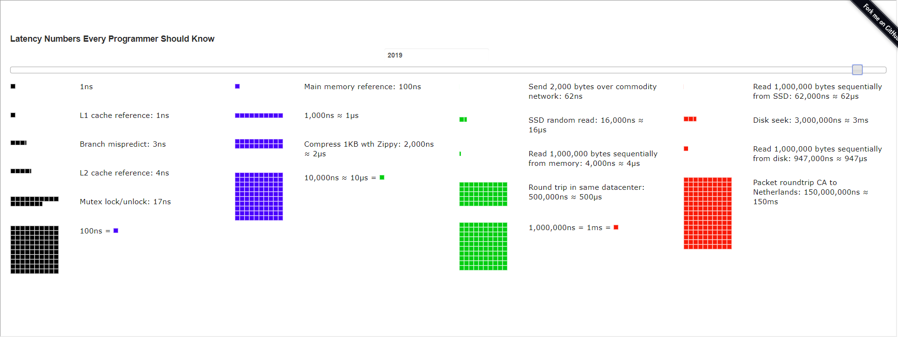

# CPU:不是针对你一个人，我是说在座的各位都是垃圾
```
L1 cache reference ......................... 0.5 ns
Branch mispredict ............................ 5 ns
L2 cache reference ........................... 7 ns
Mutex lock/unlock ........................... 25 ns
Main memory reference ...................... 100 ns             
Compress 1K bytes with Zippy ............. 3,000 ns  =   3 µs
Send 2K bytes over 1 Gbps network ....... 20,000 ns  =  20 µs
SSD random read ........................ 150,000 ns  = 150 µs
Read 1 MB sequentially from memory ..... 250,000 ns  = 250 µs
Round trip within same datacenter ...... 500,000 ns  = 0.5 ms
Read 1 MB sequentially from SSD* ..... 1,000,000 ns  =   1 ms
Disk seek ........................... 10,000,000 ns  =  10 ms
Read 1 MB sequentially from disk .... 20,000,000 ns  =  20 ms
Send packet CA->Netherlands->CA .... 150,000,000 ns  = 150 ms
```



## 解读

- 先来看看 CPU 的速度，就拿我的电脑来说，主频是 `2.6G`，也就是说每秒可以执行 `2.6*10^9` 个指令，每个指令只需要 `0.38ns`（现在很多个人计算机的主频要比这个高，配置比较高的能达到 3.0G+）。我们把这个时间当做基本单位 `1s`，因为 `1s` 大概是人类能感知的最小时间单位。

- 一级缓存读取时间为 `0.5ns`，换算成人类时间大约是 `1.3s`，大约一次或者两次心跳的时间。这里能看出缓存的重要性，因为它的速度可以赶上 CPU，程序本身的 locality 特性加上指令层级上的优化，cache 访问的命中率很高，这最终能极大提高效率。

- 分支预测错误需要耗时 `5ns`，换算成人类时间大约是 `13s`，这个就有点久了，所以你会看到很多文章分析如何优化代码来降低分支预测的几率

- 二级缓存时间就比较久了，大约在 `7ns`，换算成人类时间大约是 `18.2s`，可以看到的是如果一级缓存没有命中，然后去二级缓存读取数据，时间差了一个数量级。

- 我们继续，互斥锁的加锁和解锁时间需要 `25ns`，换算成人类时间大约是 `65s`，首次达到了一分钟。并发编程中，我们经常听说锁是一个很耗时的东西，因为在微波炉里加热一个东西需要一分钟的话，你要在那傻傻地等蛮久了。

- 然后就到了内存，每次内存寻址需要 `100ns`，换算成人类时间是 `260s`，也就是4分多钟，如果读一些不需要太多思考的文章，这么久能读完2-3千字（这个快阅读的时代，很少人在手机上能静心多这么字了）。看起来还不算坏，不多要从内存中读取一段数据需要的时间会更多。到了内存之后，时间就变了一个量级，CPU 和内存之间的速度瓶颈被称为冯诺依曼瓶颈。

- 一次 CPU 上下文切换（系统调用）需要大约 `1500ns`，也就是 `1.5us`（这个数字采用的是单核 CPU 线程平均时间），换算成人类时间大约是 `65`分钟，嗯，也就是一个小时。我们也知道上下文切换是很耗时的行为，毕竟每次浪费一个小时，也很让人有罪恶感的。上下文切换更恐怖的事情在于，这段时间里 CPU 没有做任何有用的计算，只是切换了两个不同进程的寄存器和内存状态；而且这个过程还破坏了缓存，让后续的计算更加耗时。

- 在 1Gbps 的网络上传输 2K 的数据需要 `20us`，换算成人类时间是 `14.4`小时，这么久都能把《星球大战》六部曲看完了（甚至还加上吃饭撒尿的时间）！可以看到网络上非常少数据传输对于 CPU 来说，已经很漫长。而且这里的时间还是理论最大值，实际过程还要更慢一些。

- SSD 随机读取耗时为 `150us`，换算成人类时间大约是 `4.5`天。换句话说，SSD 读点数据，CPU 都能休假，报团参加周边游了。虽然我们知道 SSD 要比机械硬盘快很多，但是这个速度对于 CPU 来说也是像乌龟一样。I/O 设备 从硬盘开始速度开始变得漫长，这个时候我们就想起内存的好处了。尽量减少 IO 设备的读写，把最常用的数据放到内存中作为缓存是所有程序的通识。像 memcached 和 redis 这样的高速缓存系统近几年的异军突起，就是解决了这里的问题。

- 从内存中读取 1MB 的连续数据，耗时大约为 `250us`，换算成人类时间是 `7.5`天，这次假期升级到国庆七天国外游了。

- 同一个数据中心网络上跑一个来回需要 `0.5`ms，换算成人类时间大约是 `15`天，也就是半个月的时间。如果你的程序有段代码需要和数据中心的其他服务器交互，在这段时间里 CPU 都已经狂做了半个月的运算。减少不同服务组件的网络请求，是性能优化的一大课题。

- 从 SSD 读取 1MB 的顺序数据，大约需要 `1ms`，换算成人类时间是 `1`个月。也就是说 SSD 读一个普通的文件，如果要等你做完，CPU 一个月时间就荒废了。尽管如此，SSD 已经很快啦，不信你看下面机械磁盘的表现。

- 磁盘寻址时间为 `10ms`，换算成人类时间是 `10`个月，刚好够人类创造一个新的生命了。如果 CPU 需要让磁盘泡杯咖啡，在它眼里，磁盘去生了个孩子，回来告诉它你让我泡的咖啡好了。机械硬盘使用 RPM(Revolutions Per Minute/每分钟转速) 来评估磁盘的性能：RPM 越大，平均寻址时间更短，磁盘性能越好。寻址只是把磁头移动到正确的磁道上，然后才能读取指定扇区的内容。换句话说，寻址虽然很浪费时间，但其实它并没有办任何的正事（读取磁盘内容）。

- 从磁盘读取 1MB 连续数据需要 `20ms`，换算成人类时间是 `20`个月。IO 设备是计算机系统的瓶颈，希望读到这里你能更深切地理解这句话！如果还不理解，不妨想想你在网上买的东西，快递送了将近两年，你的心情是怎么样的。

- 而从世界上不同城市网络上走一个来回，平均需要 `150ms`（参考世界各地 ping 报文的时间），换算成人类时间是 `12.5`年。不难理解，所有的程序和架构都会尽量避免不同城市甚至是跨国家的网络访问，CDN 就是这个问题的一个解决方案：让用户和最接近自己的服务器交互，从而减少网络上报文的传输时间。

- 虚拟机重启一次大约要 `4s` 时间，换算成人类的时间是 `3百多年`。对于此，我想到了乔布斯要死命优化 Mac 系统开机启动时间的故事。如果机器能少重启而且每次启动能快一点，不仅能救人命，也能救 CPU 的命。

- 物理服务器重启一次需要 `5min`，换算成人类时间是 `2万5千年`，快赶上人类的文明史了。5 分钟人类都要等一会了，更别提 CPU 了，所以没事不要乱重启服务器啊，分分钟终结一个文明的节奏。

文章来自[让 CPU 告诉你硬盘和网络到底有多慢](https://cizixs.com/2017/01/03/how-slow-is-disk-and-network/)

数据来自于[Latency Numbers Every Programmer Should Know](https://gist.github.com/hellerbarde/2843375)

同步每年数据[Latency Numbers Every Programmer Should Know](https://people.eecs.berkeley.edu/~rcs/research/interactive_latency.html)
