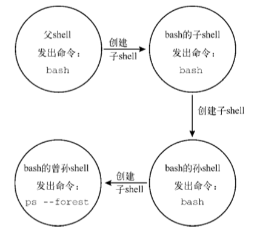

### 理解shell
CLI（文本交互界面）。   
`shell`有很多种类型，`bash`使用的最为广泛，所以大部分的`linux`系统启动之后会自动启动`bash`。你可以到`/etc/passwd`文件当中查看每个用户登录之后自动启动了什么`shell`。最后一个冒号后面的`/bin/bash`就是代表了不同的`shell`。  
登录完成后，启动的是系统自带的`bash`，我们自己也可以启动`bash`。输入`bash`之后，我们用`ps -f`查看。
```
UID        PID  PPID  C STIME TTY          TIME CMD
root      1915 29666  0 17:06 pts/1    00:00:00 bash
root      1932  1915  0 17:06 pts/1    00:00:00 ps -f
root     29666 29658  0 15:36 pts/1    00:00:00 -bash
```
发现有了两个`bash`，一个是系统自带的，一个是我们启动的。而我们使用命令`ps -f`也是一个进程，这个进程的`PPID`也就是父ID是我们自己启动的`bash`的`PID`。



多个`bash`，我们可以用`exit`慢慢一层层的退出。当到系统自带的bash时候我们再退出会发生什么？退出了这个系统。需要重新登录才行。

同一行可以输入多个命令，只需要我们用`;`来隔离命令就可以了。`ps -f;pwd;ls`。这样的命令只是按照顺序去执行，假如把这些命令加上一个括号`()`他们就变成了一个进程，生成一个子`shell`来执行。我们可以用`echo $BASH_SUBSHELL`来显示现在有没有子`shell`。
>进程列表是一种命令分组（command grouping）。另一种命令分组是将命令放入花括号中， 并在命令列表尾部加上分号（;）。语法为{ command; }。使用花括号进行命令分组并不 会像进程列表那样创建出子shell。

想要一边运行`shell`，但是又想再执行其他`shell`。比如`sleep 10`，执行之后，`CLI`会过10秒才再次出现。假如我们在后面加上`&`，这个`shell`就会到后台去执行。`sleep 10&`,并且显示一个`PID`。  
我们可以用`ps`命令查看，也可以用`jobs`命令查看，用`jobs`查看我们还能看出这个`shell`的执行状态是`running`还是`done`

这当中还有一个协程，用的命令是`coproc`。不太懂……

`shell`还分内建命令和外部命令，比如`ps`就是一个外部命令。我们可以用`which`或者`type`来显示这个命令到底是内建或者外部。`which ps; type -a ps`
```
/usr/bin/ps
ps is /usr/bin/ps
```

内建命令查看则是不同的结果`which cd; type -a cd`
```
/usr/bin/cd
cd is a shell builtin
cd is /usr/bin/cd
```

我们用了这么多命令，有的时候一个命令太长了，我们不想重新输入，可以到history当中查找，然后重新输入。history能保留一千多条使用过的命令。

有的时候我们感觉有些命令加上参数经常用到，但是一直这么输入有些麻烦，所以我们可以用alias给经常用的命令取个别名。     
`alias ll='ls -alF'`    
以后我们只需要输入ll就能看到`ls -alF`命令同样的信息，是不是很方便。不过他只能在定义的shell下面运行。


